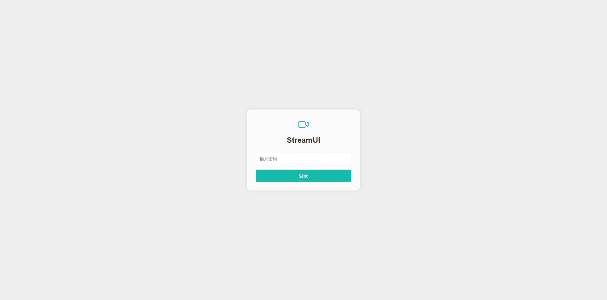
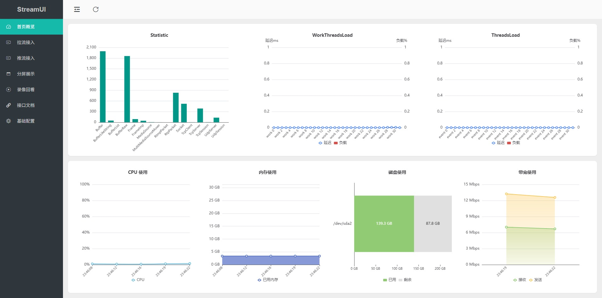
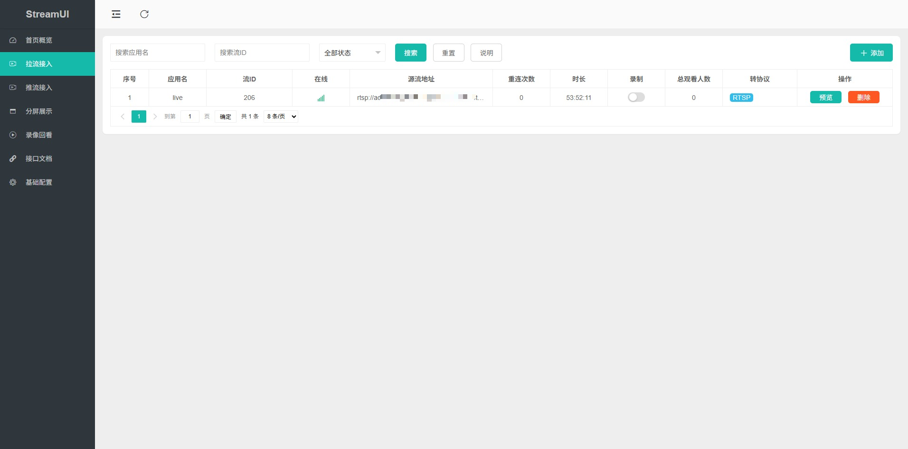
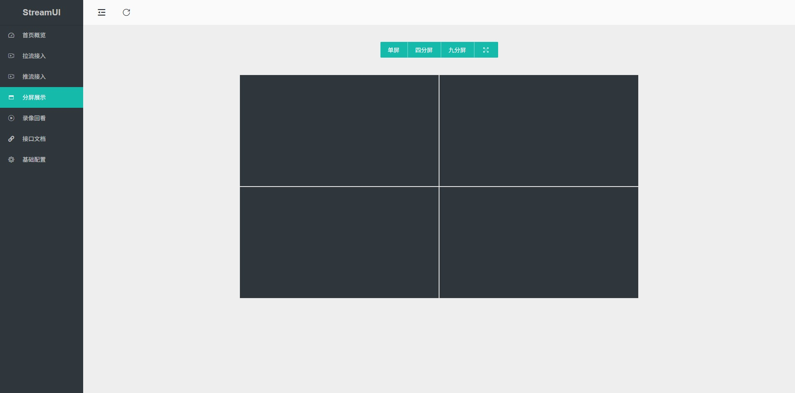
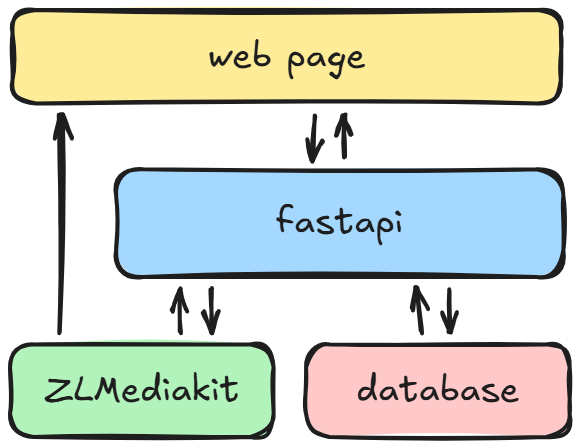

<div align="center">
  
  <h1>StreamUI</h1>
</div>

一个极简轻量的视频流媒体管理平台，开箱即用，易于扩展

> StreamUI 中 Stream 取自 [ZLMediaKit](https://github.com/ZLMediaKit/ZLMediaKit) 流概念，UI 取自 [Layui](https://github.com/layui/layui)。整体设计以蓝绿色（`#16baaa`）为主色调，秉持 “简洁、易用、可扩展” 的理念，在代码复杂度与功能实现之间不断权衡取舍，执着追求极简之美

### Features

✅ 支持 RTSP/RTMP/HLS/WebRTC/RTP/GB28181 等主流协议的拉流接入、拉流保存

✅ 支持 RTSP/RTMP/RTP 等协议的推流接入

✅ 支持接入流分发 RTSP/WebRTC/RTMP/FLV/HLS/HLS-fMP4/HTTP-TS/HTTP-fMP4 等协议

✅ 支持接入流 1x1、2x2、3x3 多屏播放

✅ 支持接入流本地录制、回放、下载、自动清理等功能

StreamUI 重在流管理，暂不支持 ONVIF、GB28181 设备的识别、流接入、云台控制

### Quick Start

此项目推荐使用 Docker Compose 部署

```shell
cd ./docker
docker compose up -d
```

运行后，打开浏览器并转到`http://{你的服务器 IP}:10800`登录

默认密码为`streamui`，你可以在 [login.html](./frontend/login.html) 中更改它

### Tips

首次启动后，建议先进入 [基础配置] 页面，根据业务需要修改配置

- 考虑开启按需转发，优点是节省带宽，缺点是第一个观众观看时，需要等待转发流启动

- 考虑关掉不需要转发的协议，比如不需要分发 RTMP 协议，就关掉 RTMP 转发

- 考虑开启 faststart，优点是播放时可以快速 seek，缺点是录制时需要多占用一些存储空间

- 考虑增大 GOP 缓存，优点是播放平滑，录制事件视频回溯时间变长，缺点是增大内存占用

更多选项深入研究请参考 ZLMediaKit 的 [配置](https://github.com/ZLMediaKit/ZLMediaKit/tree/master/conf)

### Snapshots

<table>
    <tr>
        <td ><center>登录页面</center></td>
        <td ><center>首页</center></td>
    </tr>
    <tr>
        <td ><center>拉流接入</center></td>
        <td ><center>分屏播放</center></td>
    </tr>
</table>

### Architecture

StreamUI 追求极简实现，前端未采用 Vue、React 等重量级框架，后端也避开了功能繁杂的 Java Spring 体系，转而选用轻量级的 Layui 与 FastAPI 组合，整体架构简洁清晰，易于理解和二次开发

代码结构如下所示

```bash
├── backend
│   ├── db  # 数据库目录
│   ├── main.py  # 接口
│   ├── scheduler.py  # 定时任务
│   └── utils.py  # 工具函数 
│
├── frontend
│   ├── assets  # 静态资源
│   ├── index.html  # 主页面
│   ├── login.html  # 登录页面
│   └── pages
│       ├── home.html  # 首页概览
│       ├── playback.html  # 录像回放
│       ├── pull-stream.html  # 拉流接入
│       ├── settings.html  # 基础配置
│       ├── push-stream.html  # 推流接入
│       └── wall.html  # 分屏展示
```

整体框架图如下所示

<p style="margin: 10px 0px" align="center">
  
</p>


你可以根据自己的需求，在 StreamUI 的基础上添加新的功能或修改现有功能（如添加 ONVIF、GB28181 设备的识别、流接入、云台控制等）

### Thanks

- [ZLMediaKit](https://github.com/ZLMediaKit/ZLMediaKit)
- [Layui](https://github.com/layui/layui)
- [FastAPI](https://fastapi.tiangolo.com/)

🥰 Our project is now recommended by https://github.com/ZLMediaKit/ZLMediaKit

### License

StreamUI is licensed under the [MIT License](./LICENSE)
