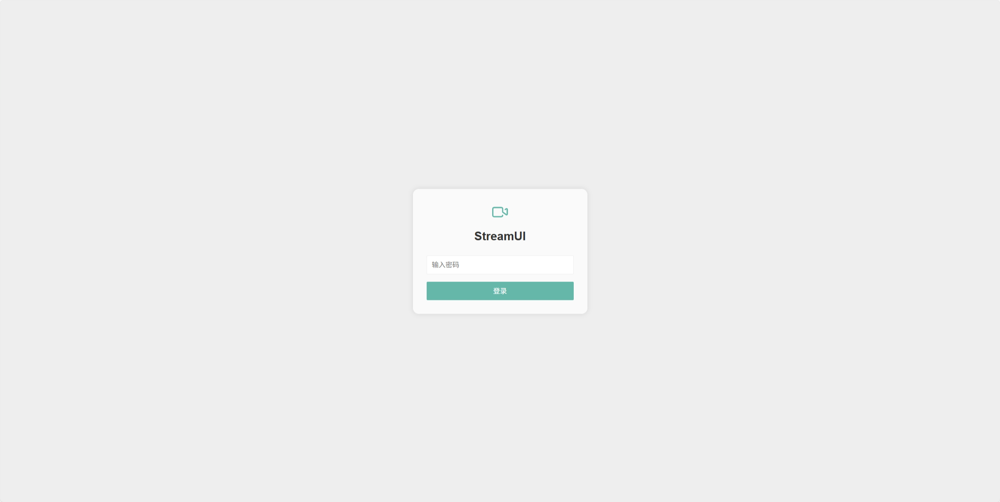
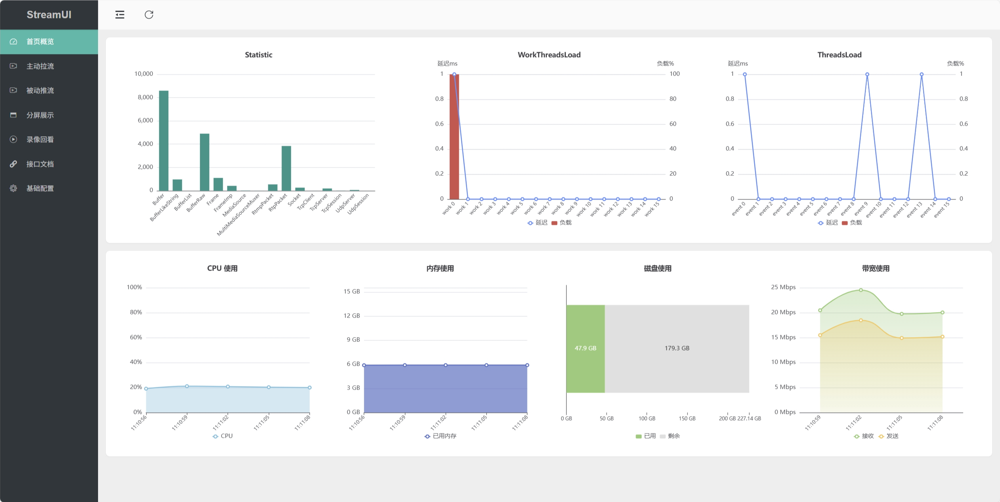

<div align="center">
  
  <h1>StreamUI</h1>
</div>

### 概述

🚀 一个极简、轻便的视频流媒体管理平台

> StreamUI 中 Stream 取自 [ZLMediaKit](https://github.com/ZLMediaKit/ZLMediaKit) 流概念，UI 取自 [Layui](https://github.com/layui/layui)，主题色以蓝绿色（#16baaa）为主，以简单、易用、可扩展为设计理念，在代码复杂度和功能实现度之间反复不断取舍

### 支持功能

- 支持 RTSP/RTMP/HLS/WebRTC/RTP/GB28181 等主流协议的拉流推流接入

- 支持 ONVIF 设备识别，云台控制

- 支持分发 RTSP/WebRTC/RTMP/FLV/HLS/HLS-fMP4/HTTP-TS/HTTP-fMP4 等协议

- 支持多屏播放

- 支持流本地录制、回放、下载、自动清理，支持流事件录制

- 支持 GB28181 接入/级联（coming soon ...）

### 快速启动

本项目推荐 `docker compose` 部署

```bash
cd ./docker
docker compose up -d  # 旧 docker 用 docker-compose up -d
```

开启后，访问 `http://{服务器地址}:10800` 即可登录，默认密码为 `streamui`（可在 `./frontend/login.html` 修改密码）

如果修改配置后需要重启，请运行

```bash
docker compose restart
```

🤗 推荐启动后，先根据业务需要修改配置再重启使用（重启后需重新拉流）

- 考虑开启按需转发，优点是节省带宽，缺点是第一个观众观看时，需要等待转发流启动

- 考虑关掉不需要转发的协议，比如不需要分发 RTMP 协议，就关掉 RTMP 转发

- 考虑开启 faststart，优点是播放时可以快速 seek，缺点是录制时需要多占用一些存储空间

- 考虑增大 GOP 缓存，优点是播放平滑，录制事件视频回溯时间变长，缺点是增大内存占用

- 更多选项深入研究请参考 zlmediakit 的 [配置说明](https://github.com/ZLMediaKit/ZLMediaKit/tree/master/conf)

### 效果图




